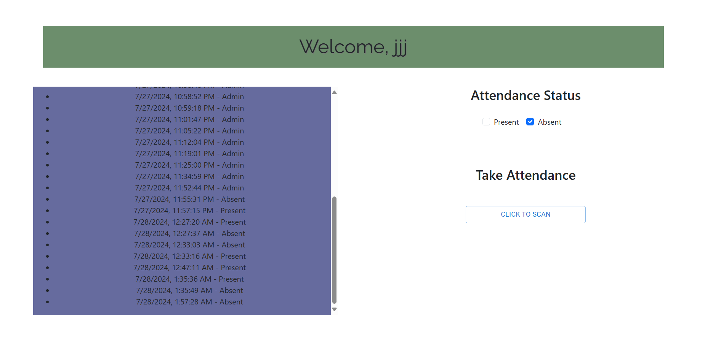

BOT (Be On Time) is a attendance management tool open for small business/college. Facilitates the flow of attendance for professors/managers/supervisors providing a history report of each student or member.

Problems:

1. Time-consuming attendance tracking: It can be laborious if taking manually attendance for larger classes.

2. Unaccurate records: Lead to errors in attendance cards.

3. Can take professor's time that can be used within teaching/mentoring.


Solutions:

1. Accurate history/time
2. Easy Attendance Tracking
3. Automated Reports

*In terms of students and/or employees*
1. Better academic/professional performance
2. Improved Time Management


<p align="center">
  <a href="https://evilmartians.com/?utm_source=size-limit">
    
  </a>
</p>

## Who can use BOT (Be On Time)

* Schools (college, university, high-school)
* Small Business
* Medium-Size Business
* Government Agencies

## How It Works

1. Authenticates users by collecting data such as username, email, password, and position (whether you are a student or teacher) [for now]
2. Professors can start the time attendance by just clicking a button
3. Students are notified by the app whether the attendance is started. Allow students to complete the attendance by just one click
4. Generates a history report of each user regarding the class, giving you info such as date, time, and status attendance.
5. Can generate an excel file that can be sent to the professor.


## Usage

### JS Applications

For elementary/middle-school parents can keep track of the children attendance, promoting engagements. Within college/university students can receive notifications regarding their classes and whether the attendance has started.

HR teams can use the app to track employee attendance, improving accuracy. Can bring engagement in remote work environment, effectively evaluating thier remote work policies. 

<details><summary><b>Show instructions</b></summary>

1. Install the requirements.txt file:

    ```Git Bash
    .\venv\Scripts\activate
    pip install -r requirements.txt

    ```

2. Install frontend:

    ```
    cd frontend
    cd react-fronten
    npm install
    npm start
    ```

3. Install Backend:

    ```
    cd backend
    flask run
    ```

4. Run the application:

    ```frontend
      npm start
    ```
    ```backend
    flask run
    ```